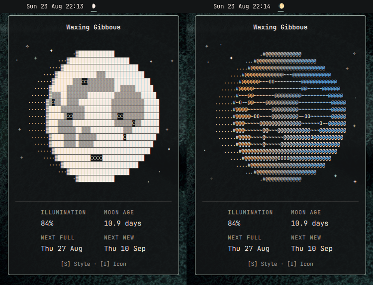

# Luna

A moon phase plugin for the Omarchy Quattro bar. Shows the current lunar
phase as a pill in the bar and renders it as stylized text art in a popup —
fully offline, with no network calls.



## Install

```sh
omarchy plugin add https://github.com/salmun-nister/omarchy-luna.git --enable
```

Then add **Luna** to your bar from the bar editor, or move it to a section:

```sh
omarchy bar move salmun-nister.luna --section right
```

## Usage

- **Left-click** the pill — open/close the popup (Escape closes)
- **Middle-click** the pill, **click the moon**, or press **S** / **Enter**
  while the popup is open — cycle through different art styles
- **I** while the popup is open — toggle the pill icon between color emoji
  and a plain monochrome glyph that inherits the theme's text color
- **Right-click** the pill — desktop notification summarizing the phase
- **Tab** while the popup is open — switch to the neighboring panel

The disk is rendered at the exact phase fraction with lunar features loosely
inspired by the real near side: craters (Tycho, Copernicus, Kepler,
Aristarchus, Plato, Gassendi, Langrenus, Grimaldi) and dark maria (Imbrium,
Serenitatis, Tranquillitatis, Fecunditatis, Crisium, Nubium, Humorum and
Oceanus Procellarum); each appears only when its position is illuminated.
Stars twinkle around it, reshuffled every time the popup opens or the
style changes.

## Settings

Settings are flat keys on the widget's entry in the `bar.layout` section of
`~/.config/omarchy/shell.json`:

```jsonc
{
  "id": "salmun-nister.luna",
  "artStyle": "blocks",   // "blocks" | "ascii" | "vector" | "cartoon";
                          // cycling rewrites this entry, so omitting it
                          // resumes the last-used style
  "artRows": 19,          // 9–41 (odd enforced); columns derive from the
                          // font's cell aspect so the moon stays circular
  "hemisphere": "north",  // "north" | "south" — defaults to north; set
                          // "south" if you're below the equator (mirrors
                          // the art/glyphs)
  "showPercent": false,   // append illumination % to the bar pill
  "plainIcon": true       // pill icon: plain monochrome Nerd Font glyph
                          // (theme text color) instead of color emoji
}
```

The moon art inherits your theme's foreground color automatically; nothing is
hardcoded.

## Accuracy

Phase fraction, illumination, and glyphs use the mean synodic month anchored
to a reference new moon. The *next new/full moon* timestamps go further:
periodic corrections from Meeus' "Astronomical Algorithms" (ch. 49) bring each
predicted instant to within a few minutes of true syzygy near J2000 (verified
against 2026 almanac data; a plain mean-month model drifts by up to half a day
and can even name the wrong day).

## Update

```sh
omarchy plugin update salmun-nister.luna
```

## Remove

```sh
omarchy plugin remove salmun-nister.luna
```

## Future Considerations

- Add and improve art styles
- Add additional Easter eggs

Have a feature idea or found a bug? Open an issue.

## License

MIT — see [LICENSE](LICENSE).
